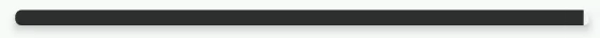

# WormProgressBar

A worm like animation of a progress bar in Android

[](https://jitpack.io/#trisl/WormProgressBar)
[](https://android-arsenal.com/api?level=21)


## Usage
- Add view into your layout file
```xml
<com.tristanroussel.worm.WormProgressBar
    android:id="@+id/worm_view"
    android:layout_width="match_parent"
    android:layout_height="10dp"
    app:layout_constraintBottom_toBottomOf="parent"
    app:layout_constraintTop_toTopOf="parent"/>
```

- Once in your view file, init the animation
```kotlin
wormProgressBar.initAnimation()
```

- You can now start the animation ...

```kotlin
wormProgressBar.start()
```

- ... pause it ... 

```kotlin
wormProgressBar.pause()
```

- ... Or complete it with an animation or not

```kotlin
wormProgressBar.complete(animating = true)
```

## Configuration
You can configure the duration and interpolator of the animation. By default, the duration is 500ms and has an AccelerateDecelerateInterpolator.
```kotlin
wormProgressBar.initAnimation(
    WormAnimationConfiguration(
        duration = 1000L,
        interpolator = AccelerateInterpolator()
    )
)
```

## Setup
- Add the JitPack repository to your build file. Add it in your root build.gradle at the end of repositories
```
allprojects {
	repositories {
		...
		maven { url 'https://jitpack.io' }
	}
}
```

- Add the dependency
```
dependencies {
    implementation 'com.github.trisl:WormProgressBar:1.0.0'
}
```

## License